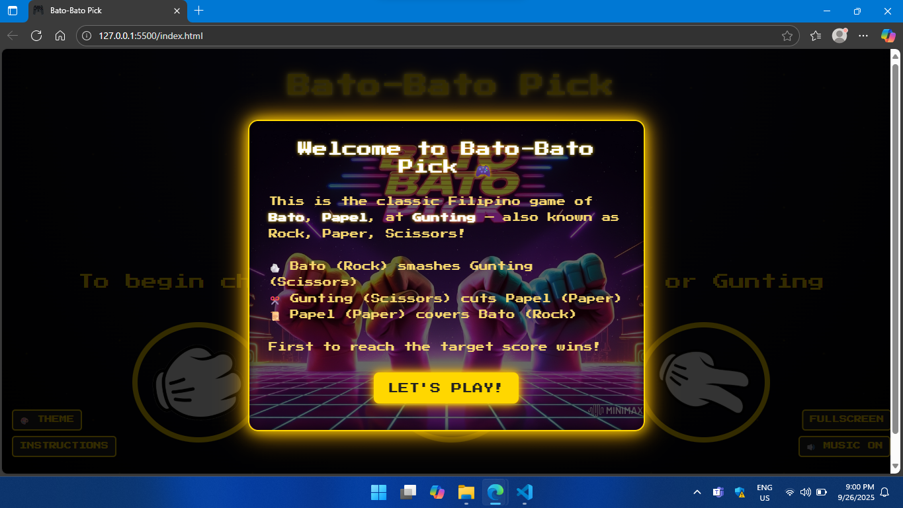

# Bato-Bato Pick (Rock-Paper-Scissors Arcade Edition)

Bato-Bato Pick is a **Filipino-inspired arcade version** of the classic Rock-Paper-Scissors game.  
It combines **retro neon visuals**, **arcade-style sound effects**, and even **API-powered jokes/advice** to keep the game fun and lively!  

---

## Features
**Classic Gameplay** – Rock beats Scissors, Scissors beat Paper, Paper beats Rock.  
**Background Music** – Toggle arcade-style background music with a button.  
**Responsive Design** – Fully playable on desktop and mobile.  
**Arcade Theme** – Neon gold retro UI with glowing effects.  
**API Fun** – Displays random jokes or advice when the game ends.  
**Instructions & Intro Modals** – Easy-to-understand guide for first-time players.  
**First-to-N Scoring System** – Choose how many wins it takes to be the champ!  

---

## How to Play
1. Choose your move: **Bato (Rock)**, **Papel (Paper)**, or **Gunting (Scissors)**.  
2. The computer will make its move.  
3. Winner of each round is announced instantly.  
4. First to reach the target score (3, 4, or 5) wins the game!  
5. Reset anytime with the **RESET** button.  

---

## Tech Stack
- **HTML5** – Structure of the game.  
- **CSS3** – Arcade neon styling and responsiveness.  
- **JavaScript (ES6)** – Game logic and interactions.  
- **API Integration** – Adds fun quotes/jokes at the end of each game.  

---

## Project Structure
├── index.html # Main game file
├── style.css # Styling and responsive design
├── script.js # Game logic + API integration
├── images/ # Rock, Paper, Scissors icons
├── sounds/ # Background music
└── README.md # Project documentation

---

## License
© 2025 Bato-Bato Pick. All Rights Reserved.  
This project was created for fun and learning purposes.  

---

## Future Improvements
- Add a **Game Over screen** with animation effects.  
- Support **multiplayer mode** (player vs player).  
- Add a **leaderboard** to track high scores.  
- More theme options (e.g., cyberpunk, retro console). 

*"The Filipino classic, reborn in neon arcade style!"*  

